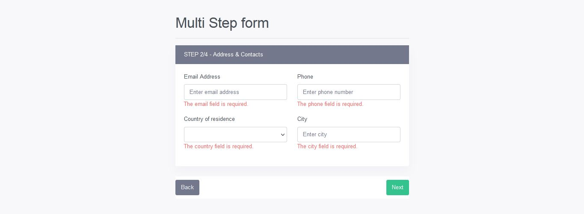

# Multi Step Form Using Livewire in Laravel



Laravel livewire is a user-friendly package for developing full-stack web applications; it lowers the pain of building dynamic user interface components. You are going to understand how to use this package to create a dynamic multi-step form with a laravel form wizard using livewire.
Forms are useful for collecting user information, Sometimes, you need to build advanced forms that need to be categorized in multi-steps. This tutorial will guide you from scratch about how to create a multi-step way not only but also form a wizard with the help of the livewire package in the laravel 8 application.

> ### Routes
```php
Route::view('/register','register')->name('register');
Route::view('/registration-success','registration-success')->name('registration.success');
```
> ### register.blade.php
```php
<!DOCTYPE html>
<html lang="en">
<head>
    <meta charset="UTF-8">
    <meta http-equiv="X-UA-Compatible" content="IE=edge">
    <meta name="viewport" content="width=device-width, initial-scale=1.0">
    <title>Register</title>
    <link rel="stylesheet" href="{{ asset('bootstrap.min.css') }}">
    @livewireStyles
</head>
<body>

   <div class="container">
       <div class="row" style="margin-top:50px">
             <div class="col-md-6 offset-md-3">
                 <h1>Multi Step form</h1><hr>
                 @livewire('multi-step-form')
             </div>
       </div>
   </div>
    
    @livewireScripts
</body>
</html>
```

> ### multi-step-form.blade.php
This is the content of multi step form livewire blade component.
```php
<div>
    
     <form wire:submit.prevent="register">

         {{-- STEP 1 --}}

         @if ($currentStep == 1)
             
      
         <div class="step-one">
             <div class="card">
                 <div class="card-header bg-secondary text-white">STEP 1/4 - Personal Details</div>
                 <div class="card-body">
                     <div class="row">
                         <div class="col-md-6">
                             <div class="form-group">
                                 <label for="">First name</label>
                                 <input type="text" class="form-control" placeholder="Enter first name" wire:model="first_name">
                                <span class="text-danger">@error('first_name'){{ $message }}@enderror</span>
                             </div>
                         </div>
                         <div class="col-md-6">
                            <div class="form-group">
                                <label for="">Last name</label>
                                <input type="text" class="form-control" placeholder="Enter last name" wire:model="last_name">
                                <span class="text-danger">@error('last_name'){{ $message }}@enderror</span>
                            </div>
                        </div>
                     </div>
                     <div class="row">
                         <div class="col-md-6">
                             <div class="form-group">
                                 <label for="">Gender</label>
                                 <select  class="form-control" wire:model="gender">
                                        <option value="" selected>Choose gender</option>
                                        <option value="male">Male</option>
                                        <option value="female">Female</option>
                                 </select>
                                 <span class="text-danger">@error('gender'){{ $message }}@enderror</span>
                             </div>
                         </div>
                         <div class="col-md-6">
                             <div class="form-group">
                                 <label for="">Age</label>
                                 <input type="text" class="form-control" placeholder="Enter your age" wire:model="age">
                                 <span class="text-danger">@error('age'){{ $message }}@enderror</span>
                             </div>
                         </div>
                     </div>
                     <div class="form-group">
                         <label for="">Description</label>
                         <textarea class="form-control" cols="2" rows="2" wire:model="description"></textarea>
                         <span class="text-danger">@error('description'){{ $message }}@enderror</span>
                     </div>
                 </div>
             </div>
         </div>
         @endif

         {{-- STEP 2 --}}

         @if ($currentStep == 2)
             
        
         <div class="step-two">
             <div class="card">
                 <div class="card-header bg-secondary text-white">STEP 2/4 - Address & Contacts</div>
                 <div class="card-body">
                     <div class="row">
                         <div class="col-md-6">
                             <div class="form-group">
                                 <label for="">Email Address</label>
                                 <input type="text" class="form-control" placeholder="Enter email address" wire:model="email">
                                 <span class="text-danger">@error('email'){{ $message }}@enderror</span>
                             </div>
                         </div>
                         <div class="col-md-6">
                            <div class="form-group">
                                <label for="">Phone</label>
                                <input type="text" class="form-control" placeholder="Enter phone number" wire:model="phone">
                                <span class="text-danger">@error('phone'){{ $message }}@enderror</span>
                            </div>
                        </div>
                     </div>
                     <div class="row">
                         <div class="col-md-6">
                             <div class="form-group">
                                 <label for="">Country of residence</label>
                                 <select class="form-control" wire:model="country">
                                     <option value="" selected>Select country</option>
                                     <option value="United States">United States</option>
                                     <option value="India">India</option>
                                     <option value="Rwanda">Rwanda</option>
                                     <option value="Nigeria">Nigeria</option>
                                     <option value="Phillipines">Phillipines</option>
                                     <option value="Canada">Canada</option>
                                     <option value="Bangladesh">Bangladesh</option>
                                 </select>
                                 <span class="text-danger">@error('country'){{ $message }}@enderror</span>
                             </div>
                         </div>
                         <div class="col-md-6">
                             <div class="form-group">
                                 <label for="">City</label>
                                 <input type="text" class="form-control" placeholder="Enter city" wire:model="city">
                                 <span class="text-danger">@error('city'){{ $message }}@enderror</span>
                             </div>
                         </div>
                     </div>
                 </div>
             </div>
         </div>

         @endif
         {{-- STEP 3 --}}

         @if ($currentStep == 3)
             
     
         <div class="step-three">
             <div class="card">
                 <div class="card-header bg-secondary text-white">STEP 3/4 - Frameworks experience</div>
                 <div class="card-body">
                     Lorem ipsum dolor sit amet consectetur adipisicing elit. Tenetur explicabo, impedit maxime possimus excepturi veniam ut error sit, molestias aliquam repellat eos porro? Sit ex voluptates nemo veritatis delectus quia?
                     <div class="frameworks d-flex flex-column align-items-left mt-2">
                         <label for="laravel">
                             <input type="checkbox" id="laravel" value="laravel" wire:model="frameworks"> Laravel
                         </label>
                         <label for="codeigniter">
                            <input type="checkbox" id="codeigniter" value="codeigniter" wire:model="frameworks"> Codeigniter
                        </label>
                        <label for="vuejs">
                            <input type="checkbox" id="vuejs" value="vuejs" wire:model="frameworks"> Vue Js
                        </label>
                        <label for="cakePHP">
                            <input type="checkbox" id="cakePHP" value="cakePHP" wire:model="frameworks"> CakePHP
                        </label>
                     </div>
                     <span class="text-danger">@error('frameworks'){{ $message }}@enderror</span>
                 </div>
             </div>
         </div>
         @endif

         {{-- STEP 4 --}}
         @if ($currentStep == 4)
             
     
         <div class="step-four">
             <div class="card">
                 <div class="card-header bg-secondary text-white">STEP 4/4 - Attachments</div>
                 <div class="card-body">
                     Lorem, ipsum dolor sit amet consectetur adipisicing elit. Itaque delectus officia inventore id facere at aspernatur ad corrupti asperiores placeat, fugiat tempora soluta optio recusandae eligendi impedit ipsam ullam amet!
                     <div class="form-group">
                         <label for="cv">CV</label>
                         <input type="file" class="form-control" wire:model="cv">
                         <span class="text-danger">@error('cv'){{ $message }}@enderror</span>
                     </div>
                     <div class="form-group">
                         <label for="terms" class="d-block">
                             <input type="checkbox"  id="terms" wire:model="terms"> You must agree with our <a href="#">Terms and Conditions</a>
                         </label>
                         <span class="text-danger">@error('terms'){{ $message }}@enderror</span>
                     </div>
                 </div>
             </div>
         </div>

         @endif

         <div class="action-buttons d-flex justify-content-between bg-white pt-2 pb-2">

            @if ($currentStep == 1)
                <div></div>
            @endif

            @if ($currentStep == 2 || $currentStep == 3 || $currentStep == 4)
                <button type="button" class="btn btn-md btn-secondary" wire:click="decreaseStep()">Back</button>
            @endif
            
            @if ($currentStep == 1 || $currentStep == 2 || $currentStep == 3)
                <button type="button" class="btn btn-md btn-success" wire:click="increaseStep()">Next</button>
            @endif
            
            @if ($currentStep == 4)
                 <button type="submit" class="btn btn-md btn-primary">Submit</button>
            @endif
                
               
         </div>

     </form>


</div>
```

> ### MultiStepForm.php
This is the multi step form livewire class
```php
<?php

namespace App\Http\Livewire;

use Livewire\Component;
use Livewire\WithFileUploads;
use App\Models\Student;

class MultiStepForm extends Component
{
    use WithFileUploads;

    public $first_name;
    public $last_name;
    public $gender;
    public $age;
    public $description;
    public $email;
    public $phone;
    public $country;
    public $city;
    public $frameworks = [];
    public $cv;
    public $terms;

    public $totalSteps = 4;
    public $currentStep = 1;


    public function mount(){
        $this->currentStep = 1;
    }


    public function render()
    {
        return view('livewire.multi-step-form');
    }

    public function increaseStep(){
        $this->resetErrorBag();
        $this->validateData();
         $this->currentStep++;
         if($this->currentStep > $this->totalSteps){
             $this->currentStep = $this->totalSteps;
         }
    }

    public function decreaseStep(){
        $this->resetErrorBag();
        $this->currentStep--;
        if($this->currentStep < 1){
            $this->currentStep = 1;
        }
    }

    public function validateData(){

        if($this->currentStep == 1){
            $this->validate([
                'first_name'=>'required|string',
                'last_name'=>'required|string',
                'gender'=>'required',
                'age'=>'required|digits:2'
            ]);
        }
        elseif($this->currentStep == 2){
              $this->validate([
                 'email'=>'required|email|unique:students',
                 'phone'=>'required',
                 'country'=>'required',
                 'city'=>'required'
              ]);
        }
        elseif($this->currentStep == 3){
              $this->validate([
                  'frameworks'=>'required|array|min:2|max:3'
              ]);
        }
    }

    public function register(){
          $this->resetErrorBag();
          if($this->currentStep == 4){
              $this->validate([
                  'cv'=>'required|mimes:doc,docx,pdf|max:1024',
                  'terms'=>'accepted'
              ]);
          }

          $cv_name = 'CV_'.time().$this->cv->getClientOriginalName();
          $upload_cv = $this->cv->storeAs('students_cvs', $cv_name);

          if($upload_cv){
              $values = array(
                  "first_name"=>$this->first_name,
                  "last_name"=>$this->last_name,
                  "gender"=>$this->gender,
                  "email"=>$this->email,
                  "phone"=>$this->phone,
                  "country"=>$this->country,
                  "city"=>$this->city,
                  "frameworks"=>json_encode($this->frameworks),
                  "description"=>$this->description,
                  "cv"=>$cv_name,
              );

              Student::insert($values);
            //   $this->reset();
            //   $this->currentStep = 1;
            $data = ['name'=>$this->first_name.' '.$this->last_name,'email'=>$this->email];
            return redirect()->route('registration.success', $data);
          }
    }
}
```

> ### registration-success.blade.php
```php
<!DOCTYPE html>
<html lang="en">
<head>
    <meta charset="UTF-8">
    <meta name="viewport" content="width=device-width, initial-scale=1.0">
    <meta http-equiv="X-UA-Compatible" content="ie=edge">
    <title>Registration success!</title>
    <link rel="stylesheet" href="{{ asset('bootstrap.min.css') }}">
</head>
<body class="d-flex justify-content-center p-4 pt-4">
    <div class="card">
        <div class="card-header bg-success text-white">Registration complete</div>
        <div class="card-body">
            hello <b>{{ request()->name }}</b>, thank you for joining us, soon we will approve your registration. </br>
            When your account approved, you will receive your credentials on <b>{{ request()->email }}</b> </br>
            Thank you </br></br>
            <a href="/" class="btn btn-sm btn-primary">Back to home</a>
        </div>
    </div>
</body>
</html>
```